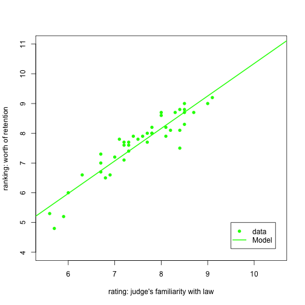

---
title       : How do attorneys rank judges?
subtitle    : a pitch presentation project for Coursera - developing data products
author      : Mike Jansen
job         : 
framework   : io2012        # {io2012, html5slides, shower, dzslides, ...}
highlighter : highlight.js  # {highlight.js, prettify, highlight}
hitheme     : tomorrow      # 
widgets     : []            # {mathjax, quiz, bootstrap}
mode        : selfcontained # {standalone, draft}
knit        : slidify::knit2slides


# <!-- https://datamj2.github.io/ddd_wk04_proj/#/ -->
# <style>
# 
# <!-- /* line 183, ../scss/default.scss */ -->
# slides > slide:not(.nobackground):after {
#   <!-- font-size: 12pt; -->
#   <!-- content: attr(data-slide-num) "/" attr(data-total-slides); -->
#   content: "2/5" ;
#   <!-- position: absolute; -->
#   <!-- bottom: 20px; -->
#   <!-- right: 60px; -->
#   <!-- line-height: 1.9; -->
#   <!-- color: darkred -->
# }
# </style>

--- .page2 #

## Ever wonder what attorneys think of judges?

- Do they think judges are fair?

- How well do they think judges know the law?

- Does the amount of contact they have with them influence their outlook?

- Which judges do they think should be retained?


## What if you had to appear in court?

- and you asked your attorney to rank the judge on a scale of 1-10

        - on fairness
        - legal knowledge
        - the number of times your attorney appeared before the judge


- what kind of judge would you be getting?

        - would your attorney think he/she is worth keeping on the bench?

--- .page3 #

## Here's an app that does that!

- it's based on the ratings of state judges in the US Superior Court

- and predicts whether or not attorneys think he/she should be retained

        - based on how attorneys rated judges in different categories
        
- giving you an idea of what kind of judge is hearing your case

## Here's how it works

 - you pick one of three categories
 
 - then select a value
 
 - the app then predicts the judicial retention rating based on that category
 
 - view with or without the prediction model

--- .page4 #

## What do some of the ratings look like? 

```r
head(USJudgeRatings)
```

```
##                CONT INTG DMNR DILG CFMG DECI PREP FAMI ORAL WRIT PHYS RTEN
## AARONSON,L.H.   5.7  7.9  7.7  7.3  7.1  7.4  7.1  7.1  7.1  7.0  8.3  7.8
## ALEXANDER,J.M.  6.8  8.9  8.8  8.5  7.8  8.1  8.0  8.0  7.8  7.9  8.5  8.7
## ARMENTANO,A.J.  7.2  8.1  7.8  7.8  7.5  7.6  7.5  7.5  7.3  7.4  7.9  7.8
## BERDON,R.I.     6.8  8.8  8.5  8.8  8.3  8.5  8.7  8.7  8.4  8.5  8.8  8.7
## BRACKEN,J.J.    7.3  6.4  4.3  6.5  6.0  6.2  5.7  5.7  5.1  5.3  5.5  4.8
## BURNS,E.B.      6.2  8.8  8.7  8.5  7.9  8.0  8.1  8.0  8.0  8.0  8.6  8.6
```

- Judge's name is in the left column

- the predictors used in the app are 

        - CONT: number of attorney contacts with the judge
        - INTG: judge's integrity, rated by attorneys
        - FAMI: judge's familiarity with the law, rated by attorney's

        


--- .page5 #

## Here's a sample plot from the app


